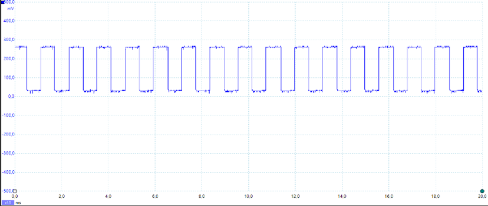
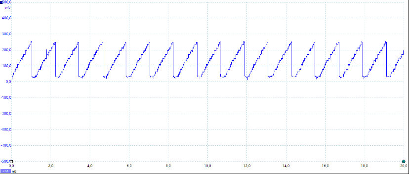
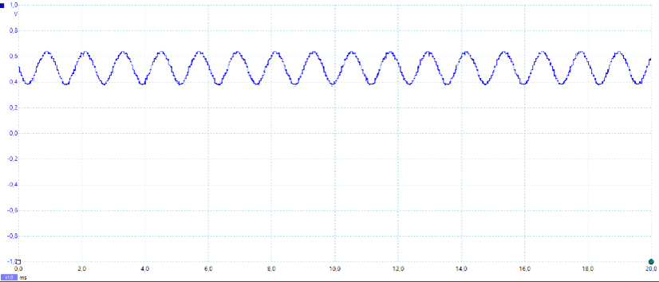
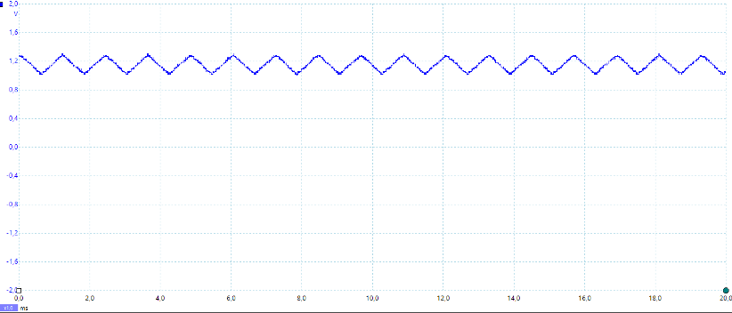

# ES-synth-starter

  Use this project as the starting point for your Embedded Systems labs and coursework.
  
  [Lab Part 1](doc/LabPart1.md)
  
  [Lab Part 2](doc/LabPart2.md)

## Additional Information

  [Handshaking and auto-detection](doc/handshaking.md)
  
  [Double buffering of audio samples](doc/doubleBuffer.md)

# Report - (Deadline Extended Until Saturday 25/03 11:59pm)
## **Our final submission for the code is called 'Code Submission (Report Extended)'**

### Display: A main menu screen that 

---
### **Tasks**
- ***scanKeysTask*** : This task executes every 50ms and is responsible for processing key presses by the user, including the joystick used for pitch bending and volume modding. It reads the new state of the keys and combines this with the previous state to detect when a key was pressed or released. As our system supports polyphony, we require the dynamic allocation of multiple phase accumulators which is handled by this task. We have determined in our analysis that our system is capable of 8-key polyphony before deadlines are not met, which is explored later.

- ***displayUpdateTask*** : Executes every 100ms and is responsible for controlling the display (resulting in a 10Hz refresh rate) - including all currently pressed keys, the volume level, octave setting and wave type / sound profile, as well as other sub menus. An arrow indicates rotation direction of the knob that need to be rotated to advance to or return from the curent menu, and the knob that needs to be rotated is indicated by the line number on the display. From the main menu, There is a separate advanced menu accessible by rotating knob 4, which contains two features: the ability to set keyboard as a Host (receiver) or an Agent (sender), and the option to access the recording and playback features of the synthesiser.

- ***decodeTask*** : This task decodes received messages and allocates pressed keys and deallocates released keys from the accumulaor.

- ***CANSend*** : Creates a 8-bit unsigned integer and allocates it the outgoing message from the queue. It checks the CAN_TX counting semaphore and send the message via CAN bus if a slot is free.  

- ***playbackTask*** : This task is responsible for the playback feature of the synthesiser and executes every 50ms, to match the scanKeysTask. This ensures that playback sounds identical to the original recording. This task is enabled only during when the playback menu is shown.
---
### **Interrupts**:

- ***CAN_RX_ISR*** : This interrupt is called when a message is received from another keyboard through the CAN bus. The message is added to a received message queue.

- ***CAN_TX_ISR*** : This is called when a CAN message is being sent through the CAN bus. It uses counting sephamores to ensure that there are enough free output slots. 

- ***sampleISR*** : This interrupt runs at 22kHz and is responsible for audio generation. A 32 bit phase accumulator and an 8 bit output digital voltage (converted to waveform via a DAC peripheral) is used. So 8 MSBs of the phase accumulator are used to account for the size of the output digital signal. Addditionally, Every note in an octave has double the frequency from the previous octave note, so there is a right/left shift of the phase accumulator depending on the octave number. ***CurrentStepSize*** shows how fast a note is changing to produce the desired frequency and according to ***WAVETYPE***, the routine will generate the corresponding analogue signal type. Our system supports 4 different wave types or sound profiles:  
&nbsp;&nbsp;&nbsp;&nbsp;⦁ Sawtooth wave  
&nbsp;&nbsp;&nbsp;&nbsp;⦁ Square wave (displayed as Pulse)  
&nbsp;&nbsp;&nbsp;&nbsp;⦁ Sine wave  
&nbsp;&nbsp;&nbsp;&nbsp;⦁ Triangle wave

  In this interrupt, additional audio modifications are also processed, such as octave scaling, pitch bending, volume modding and polyphony by taking the average of all the waves generated by each key.
  A picoscope was then used to measure the output of the DAC and verify the generated signals. The results are shown below:

## **Performance Testing**
--- 
| Tasks                     | Priority (Low to High) | Minimum Initiation Interval τi (ms) | Worst-case Execution Time Ti (ms) | [τn/τi] Ti (ms) | CPU Utilisation (%) |
|---------------------------|------------------------|-------------------------------------|----------------------------------|-----------------|----------------------|
| decodeTask               | 3                      | NA                             | 0.NA                            | N/A          | NA               |
| CANSend               | 4                      | NA                             | 0.NA                            | NA          | NA               |
| displayUpdateTask         | 2                      | 82.568                              | 17.382                           | 17.382          | 17.382               |
| scanKeysTask               | 5                      | 49.886                              | 0.095                            | 0.0574          | 0.0574               |
| playbackTask              | 1                      | 49.979                              | 0.002                            | 0.003           | 0.003                |
| sampleISR Polyphony: 11   | Interrupt              | 0.0455                              | 0.049                            | 88.919          | 88.919               |
| sampleISR Polyphony: 10   | Interrupt              | 0.0455                              | 0.046                            | 83.475          | 83.475               |
| sampleISR Polyphony: 9    | Interrupt              | 0.0455                              | 0.043                            | 78.031          | 78.031               |
| sampleISR Polyphony: 8    | Interrupt              | 0.0455                              | 0.039                            | 70.777          | 70.777               |
| sampleISR Polyphony: 7    | Interrupt              | 0.0455                              | 0.037                            | 67.143          | 67.143               |
| sampleISR Polyphony: 6    | Interrupt              | 0.0455                              | 0.034                            | 61.699          | 61.699               |
| sampleISR Polyphony: 5    | Interrupt              | 0.0455                              | 0.031                            | 56.255          | 56.255               |
| sampleISR Polyphony: 4    | Interrupt              | 0.0455                              | 0.028                            | 50.811          | 50.811               |
| sampleISR Polyphony: 3    | Interrupt              | 0.0455                              | 0.025                            | 45.367          | 45.367               |
| sampleISR Polyphony: 2    | Interrupt              | 0.0455                              | 0.021                            | 38.108          | 38.108               |
| sampleISR Polyphony: 1    | Interrupt              | 0.0455                              | 0.018                            | 32.664          | 32.664               

## Shared Resources
---
All shared resources have been protected with the use of Mutexes, Semephores, Atomic operations and Message Queueing.

- ***keyArray*** : Used in ***scanKeys()*** to identify and store key presses in a matrix. The mutex handle ***keyArrayMutex*** ensures the array is only accessed atomically and Semaphores are used to control access to the array.

- ***currentStepSize*** : Keeps track of the shift of frequencies based on the octave offset from the middle keyboard frequency. This is used during ***accumulatorMap*** allocation but also in the sound generation ISR - ***sampleISR*** Mutexes cannot be used in ISRs according to the FreeRTOS specification, so atomic stores are used to update its value.  

- ***accumulatormap, pianoKeyMap*** : The accumulator is used to allocate and deallocate keys that are currently pressed upto a 8-key limit (arbitrary value set due to CPU usage). It's accessed in the ***scanKeysTask(), displayUpdateTask()*** and ***playbackTask()***. ***pianokeymap*** keeps track of all 84 keys and is used during allocation and deallocation of accumulator. Both use atomic stores.

- **ISMASTER** : A boolean state that tracks state of host keyboard and sending keyboards. It's accessed in ***scanKeysTask(), displayUpdateTask() decodeTask(), sampleISR()*** and ***playbackTask*** so atomic stores are used 

- ***VOLUMEMOD, JOYSTICKX, JOYSTICKY*** : Used for pitch bend and volume shifting. All of these are accessed in the ***scanKeys()*** task and ***sampleISR*** so atomic stores are used.

- ***ISRECORDING, ISPLAYBACK*** : These are boolean states to determine whether the recording feature and if playback is occurring. Both are accessed in ***scanKeys*** and ***displayUpdateTask()*** and then ***ISRECORDING*** is accessed by ***accumulatorMap*** allocation/deallocate (tasks for ***accumulatorMap*** allocation mentioned above) and ***ISPLAYBACK*** in ***sampleISR*** so they both use atomic stores.

- ***CURRENTKEY, LASTKEY*** : Stores the key that was last played and the current key being played. Uses atomic stores as it's accessed in ***sampleISR, displayUpdateTask()*** and ***playbackTask()***.

- ***CAN_TX_Semaphore*** : STM32 CAN supports 3 mailboxes so a counting sephamore of maximum value 3 is used to restrict access to threads if there's more than 3 simultaneous attempts to access it. This is accessed by ***CANSend()*** and ***CAN_TX_ISR***.

*****
## Task Dependencies
---

## Advanced Features
---

### **Polyphony**
This allows multiple key output with upto 8 keys (cpu limitation) at the same time.
### **Multi-Page Menu**
An additional menu allowing access to the advanced features
### **Host/Sender Control**
Allows each keyboard to identify as a host or other (sender) through the advanced menu. The host's settings will apply to all non-host boards and sound will only play from the host's speakers.
### **Recording and Full Playback of Sequence**
Option to record a sequence of notes with a timer on display and full playback through the host's advanced menu options.

### **Sound Profiles**
 ___  ___  ___ 

## Demo of Advanced Features

https://user-images.githubusercontent.com/55187271/227695921-bdfcc190-a1b3-4bcd-b522-2e35d8b39978.mp4

