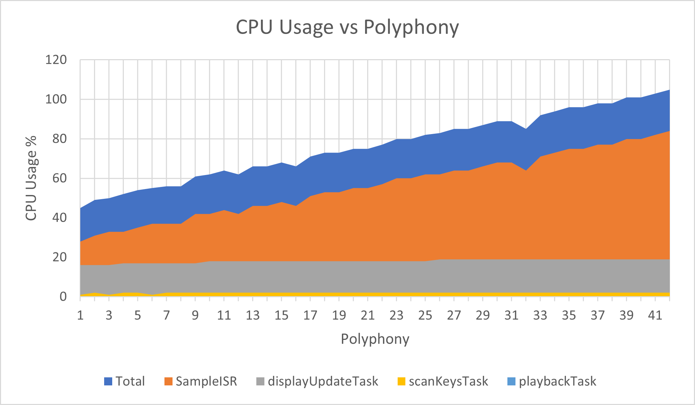
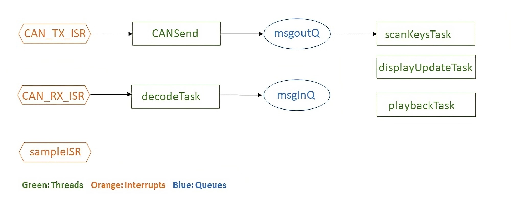

# ES-synth-starter

  Use this project as the starting point for your Embedded Systems labs and coursework.
  
  [Lab Part 1](doc/LabPart1.md)
  
  [Lab Part 2](doc/LabPart2.md)

## Additional Information

  [Handshaking and auto-detection](doc/handshaking.md)
  
  [Double buffering of audio samples](doc/doubleBuffer.md)

---
## Report - (Deadline Extended Until Saturday 25/03 11:59pm)
### **Demo of Features**  
The video below showcases all features of our system. This includes polyphony, recording/playback, pitch bend, octave selection, dynamic Host configuration and the demonstration of multiple sound profiles.

https://user-images.githubusercontent.com/55187271/227695921-bdfcc190-a1b3-4bcd-b522-2e35d8b39978.mp4  

---
### **Tasks**
- **scanKeysTask** : This task executes every 50ms and is responsible for processing key presses by the user, including the joystick used for pitch bending and volume modding. It reads the new state of the keys and combines this with the previous state to detect when a key was pressed or released. As our system supports polyphony, we require the dynamic allocation of multiple phase accumulators for key presses which is handled by this task.

- **displayUpdateTask** : Executes every 100ms and is responsible for controlling the display (resulting in a 10Hz refresh rate) - functionality includes being able to show all currently pressed keys, the volume level, octave setting and wave type/sound profile, as well as other sub menus. An arrow indicates rotation direction of the knob that need to be rotated to advance to or return from the current menu, and the knob that needs to be rotated is indicated by the line number on the display. From the main menu, there is a separate advanced menu accessible by rotating knob 4, which contains more advanced features: the ability to set keyboard as a Host (receiver) or an Agent (sender), and the option to access the recording and playback features of the synthesiser.

- **decodeTask** : This task decodes received messages from ***msgInQ*** and dynamically allocates pressed keys and deallocates released keys from the accumulator for the Host - enabling it to read keypresses from other keyboards.

- **CANSend** : This task is used to send key event data (whether a key was pressed or released) to the Host from the Agents. The information of a key event is encoded into an 8-bit unsigned integer that is sent in an outgoing message from ***msgOutQ***.

- **playbackTask** : This task is responsible for the playback feature of the synthesiser and executes every 50ms, to match the scanKeysTask frequency - ensuring that playback sounds identical to the original recording. This task is enabled only when the playback menu is shown.
---
### **Interrupts**:

- **CAN_RX_ISR** : This interrupt is called when a message is received from another keyboard through the CAN bus. This message is added to ***msgInQ***.

- **CAN_TX_ISR** : This interrupt is called when a CAN message is being sent through the CAN bus. It uses counting semaphore to ensure that there are enough mailboxes (more details in shared resources section).

- **sampleISR** : This interrupt runs at 22kHz and is responsible for audio generation. To generate audio, a 32-bit phase accumulator is incremented depending on the currently pressed key, causing it to overflow at the frequency of that key. As notes that are an octave higher are double the frequency of the notes in the current octave, a left shift of the phase accumulator depending on the octave yields the desired frequency for the key at the current octave, meaning only the increment sizes of 12 semitones need to be known. This is represented by the ***stepSizes*** array. Depending on the value of ***WAVETYPE***, denoting the current sound profile, this interrupt will use the value within the accumulators to generate the type of wave that is required, effectively behaving as a DAC. Our system supports 4 different wave types or sound profiles:  
&nbsp;&nbsp;&nbsp;&nbsp;⦁ Sawtooth wave  
&nbsp;&nbsp;&nbsp;&nbsp;⦁ Square wave (displayed as Pulse)  
&nbsp;&nbsp;&nbsp;&nbsp;⦁ Sine wave  
&nbsp;&nbsp;&nbsp;&nbsp;⦁ Triangle wave

  In this interrupt, additional audio modifications are also processed, such as octave scaling, pitch bending, volume modding and polyphony, which is done by taking the average of all the waves generated by each key from the different accumulators. The number of accumulators available in the system is equal to the POLYPHONY constant defined in ***OurLibrary.h***. Changing this constant changes the amount of simultaneous key presses that will be pressed.

## **Performance Testing**  
---  
For the timing analysis, we added pre-processor directives that switch the system from a functional build to a test build. Enabling the ***'#define TEST_MODE'*** directive puts the system in this state, and will output the time taken for the worst-case execution time for each task and interrupt. Additionally, the directive ***'#define STAT_ONLY'*** is enabled to print only the statistics to use for graph plotting.

***#define TEST_ITERATIONS 32*** tells the system to execute every task 32 times and average the results.
| Tasks | Priority | Minimum Initiation Interval τi (ms) | Worst-case Execution Time Ti (ms) | CPU Utilisation (%) |
|----|----|----|----|----|
| playbackTask      | 5 | 50  | 0.002  | 0.004   |
| scanKeysTask      | 4 | 50  | 0.095  | 0.190   |
| decodeTask        | 3 | 25.2| 0.000  | 0.000   |
| CANSend & CAN_TX_ISR | 2 | 60  | 0.008 | 0.013 |
| displayUpdateTask | 1 | 100 | 17.753 | 17.753  |
| sampleISR         | Interrupt | 0.0455  | 0.017 | 37.363 |
| CAN_RX_ISR | Interrupt | 0.7  | 0.001     | 0.14  |
| **Total**         |  |  | **17.876** | **55.463** |
--- 
The above results were collected with POLYPHONY set to 8, and 32 executions were recorded before averaging them. As our system is to sensitive to the POLYPHONY constant, denoting the number of simultaneous key presses the system will process, a graph below is shown of how changing the POLYPHONY constant affects the total CPU usage by each task.  

---
  

From the graph, it is clear that the system can support up to 38-key polyphony in worst-case conditions before becoming unstable. Our system is set to 8 key polyphony by default.

---
## Shared Resources
All shared resources have been protected with the use of mutexes, semaphores, atomic operations and message queueing.

- **keyArray** : Used in ***scanKeys()*** to identify and store the current state of key presses in a matrix. The mutex handle ***keyArrayMutex*** ensures the array is only accessed atomically and semaphores are used to control access to the array.

- **currentStepSize** : Keeps track of a key frequency based on the octave offset from the middle octave. This is used during accumulator allocation but also in  ***sampleISR***.

- **accumulatorMap, pianoKeyMap** : ***accumulatorMap*** is used to keep track of what accumulators are mapped to what keys. The deallocation and allocation of accumulators is handled dynamically depending on key events from either the CAN Bus or the Host's physical keys being pressed. ***pianoKeyMap*** serves to provide fast reverse lookup so that indexing into this array with the keyNumber reveals whether the key has an accumulator, as opposed to looping through ***accumulatorMap*** to determine if an accumulator was assigned to the key. They are written to in the ***scanKeysTask()***,  ***playbackTask()*** and **decodeTask()***. Writes are done atomically. 

- **ISMASTER** : A Boolean that represents whether the synthesiser is a Host or Agent. It is accessed in ***scanKeysTask(), decodeTask(), sampleISR()*** and is written to in ***scanKeysTask()***, therefore an atomic operation is necessary.

- **OCTAVE, VOLUMEMOD** : These are settings that are modify the audio of the synthesiser. Like ***isMaster***, the same protections are used as these variables are accessed in multiple tasks and interrupts.

- **JOYSTICKX, JOYSTICKY** : These are used for pitch bending and volume shifting. All of these are accessed in the ***scanKeys()*** task and ***sampleISR*** so atomic stores are used.

- **ISRECORDING, ISPLAYBACK** : These are Boolean states to determine whether the system is recording or performing playback. Both are accessed in ***scanKeysTask()***,  ***displayUpdateTask()***. ***ISRECORDING*** is also accessed in ***accumulatorMap*** allocation/deallocation, thus these operations are atomic.

- **CURRENTKEY, LASTKEY** : Stores the key that was last played and the current key being played. They uses atomic stores as they are accessed in ***displayUpdateTask()*** and ***playbackTask()***.

- **CAN_TX_Semaphore** : STM32 CAN supports 3 mailboxes so a counting semaphore of maximum value 3 is used to restrict access to threads if there are more than 3 simultaneous attempts to access it. This is accessed by ***CANSend()*** and ***CAN_TX_ISR***.

--- 
## Task Dependencies
---

Our aim was to make each thread as independent as possible and eliminate circular dependencies to prevent the possibility of deadlock. As seen above, the main dependency in our system is the ***CANSend*** task which is dependent on ***scanKeysTask***. If ***msgoutQ*** is empty, ***CANSend*** will block until a message is added to the queue.

## Advanced Features
---

### **Polyphony**
Our system supports the simultaneous processing of multiple key presses.
### **Multi-Page Menu**
The user is able to navigate to different displays depending on what features they would like to access.
### **Host/Sender Configuration**
Allows each keyboard to identify as a Host or Agent through the advanced menu. Sound will only play through the Host, and only the Host can change audio settings (except octave as that is local to each synthesiser).
### **Recording and Full Playback of Sequence**
Our system supports the ability to record a finite sequence of key presses (which can be configured using the MAXKEYS constant, default 512) featuring a timer on display and playback through the Host. The recording supports polyphony.
### **Pitch-bend and Volume Mod**
Using the joystick, the user can greatly change the sound being produced; moving the joystick in the Y direction results in a pitch-bend, increasing or decreasing the frequency of the sound. Moving the joystick in the X direction results in fine volume control.
### **Sound Profiles**
Our system supports 4 sound profiles (Sawtooth, Square, Sine and Triangle). The corresponding waveforms from the DAC were captured using a Picoscope and are shown below:

 
 

